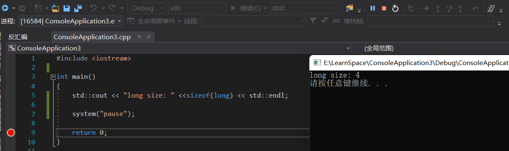

### 起因

在阅读《深入理解计算机系统》一书时，发现书中介绍C语言中的long类型，在64位机器下，占用8个字节的长度。

 

### 疑问

便想着写程序验证一下，于是用visual studio编写程序验证，编译为32位程序，结果如下：

一切正式，于是又将程序改为64位，运行结果如下：

 

结果还是4个字节，这时就有疑惑了，难道是书上讲错了吗？《深入理解计算机系统》可是非常经典的计算机书籍，按理说不会出现这种低级的错误。

于是又改为纯C的代码，使用gcc编译。

使用gcc 编译32位程序（gcc -m32 Test.c），结果如下：

一切正常，接着编译为64位程序（gcc -m64 Test.c），结果如下：

### 查证

此时发现经过到目前为止的验证，书上讲的和我们实际测试的结果，并不相符，本着刨根问底的态度，于是开始上网查询资料。经过查询，获得以下信息：

数据模型不一致，现今所有64位的类Unix平台均使用LP64数据模型，而64位Windows使用LLP64数据模型，除了指针是64位，其他基本类型都没有变。每个应用程序和每个操作系统都有一个抽象数据模型。 许多应用程序不会显式公开此数据模型，但该模型指导编写应用程序代码的方式。

各个C++实现所选择采用的基础类型的大小统称为“数据模型”。有四种广泛采用的数据模型：

32 位系统：

　　LP32 或 2/4/4（int 为 16-bit，long 和指针为 32 位）：Win16 API

　　ILP32 或 4/4/4（int，long 和指针都为 32 位）：Win32 API、Unix 和 Unix 类的系统（Linux，Mac OS X）

64 位系统：

　　LLP64 或 4/4/8（int 和 long 为 32 位，指针为 64 位）：Win64 API

　　LP64 或 4/8/8（int 为 32 位，long 和指针为 64 位）：Unix 和 Unix 类的系统（Linux，Mac OS X）

到目前为止，大概有个结论，并不是书上存在错误，而是不同平台选用的数据模型不一致，导致出现这个问题。 

### 参考资料：

https://docs.microsoft.com/zh-cn/windows/win32/winprog64/abstract-data-models?redirectedfrom=MSDN

https://stackoverflow.com/questions/9953502/how-to-make-ms-visual-c-use-lp64-instead-of-llp64

http://archive.opengroup.org/public/tech/aspen/lp64_wp.htm
