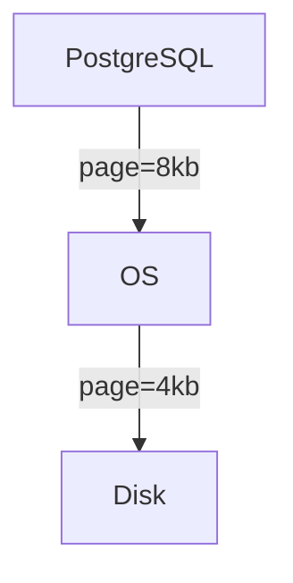
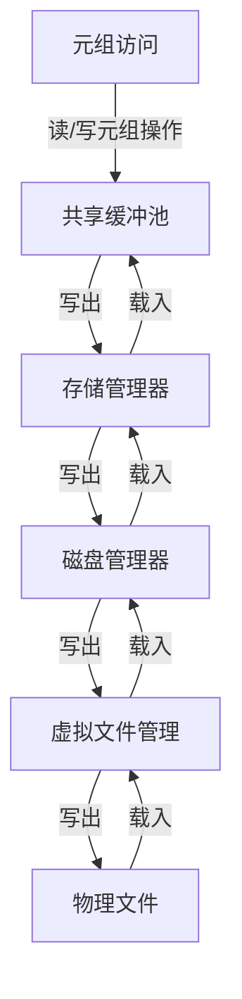
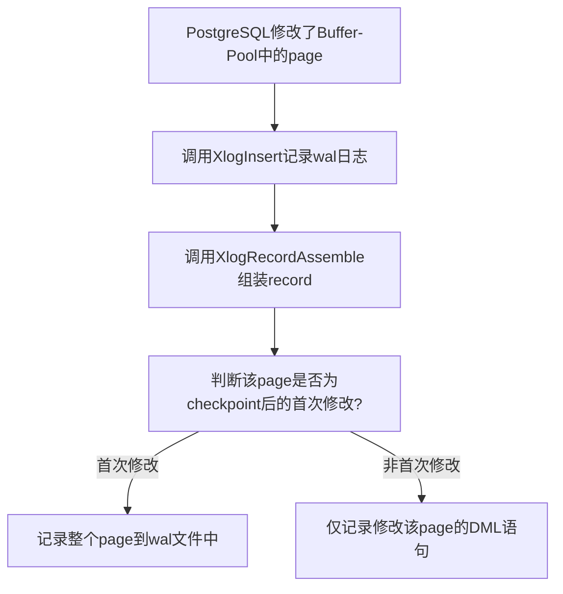
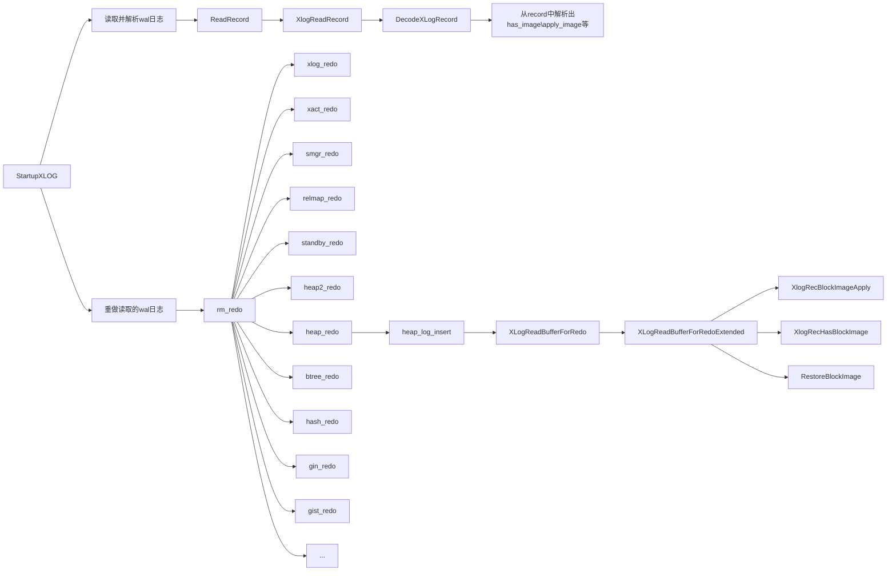

## 概念介绍

### 页断裂

页断裂也可以称为页折断或者半页写。PostgreSQL中，一个page默认为8kb，数据的写入是以page为单位的。而操作系统的一个page往往是4kb或者更小，这将导致PostgreSQL在写一个page到磁盘时，操作系统可能会将PG的一个page，分两次写入到磁盘。  如果系统出现故障，则会出现PG的一个page，操作系统只写了一半到磁盘上，这种现象称之为页折断。



当出现页折断后，页的操作可能只完成了一部分，导致磁盘上的页同时存在新旧数据，这个时候，仅通过wal的数据更改记录，并不足以恢复该页面。

目前市面上的数据库，解决页折断问题，一般有两种方法，一种是full_page_writes，一种是double write。

  采用full_page_writes的数据库：

- PostgreSQL
  
  采用double write的数据库：

- openGauss
  
  - 需结合增量检查点使用；

- MySQL

### full_page_writes

full_page_write是PostgreSQL的GUC参数，如果启用了此参数，在PG执行了checkpoint后，会将Buffer Poll中首次修改的page，整个page连同DML修改语句，都存储到wal日志中。

> PostgreSQL官网对其解释如下：
> full_page_writes (boolean)
> When this parameter is on, the PostgreSQL server writes the entire content of each disk page to WAL during the first modification of that page after a checkpoint. This is needed because a page write that is in process during an operating system crash might be only partially completed, leading to an on-disk page that contains a mix of old and new data. The row-level change data normally stored in WAL will not be enough to completely restore such a page during post-crash recovery. Storing the full page image guarantees that the page can be correctly restored, but at the price of increasing the amount of data that must be written to WAL. (Because WAL replay always starts from a checkpoint, it is sufficient to do this during the first change of each page after a checkpoint. Therefore, one way to reduce the cost of full-page writes is to increase the checkpoint interval parameters.)
> 
> Turning this parameter off speeds normal operation, but might lead to either unrecoverable data corruption, or silent data corruption, after a system failure. The risks are similar to turning off fsync, though smaller, and it should be turned off only based on the same circumstances recommended for that parameter.
> 
> Turning off this parameter does not affect use of WAL archiving for point-in-time recovery (PITR) (see Section 25.3).
> 
> This parameter can only be set in the postgresql.conf file or on the server command line. The default is on. 

## 关键数据结构

### XLogRecordBlockImageHeader

记录full-page image的相关信息，该image是否被压缩、在redo过程中，是否应该恢复整个image等信息。

```C
typedef struct XLogRecordBlockImageHeader
{
    uint16        length;         /* number of page image bytes */
    uint16        hole_offset;    /* number of bytes before "hole" */
    uint8        bimg_info;      /* flag bits, see below */
} XLogRecordBlockImageHeader;
```

其中，bimg_info用于标识image的信息，其有如下取值：

```C
#define BKPIMAGE_HAS_HOLE        0x01        /* page image has "hole" */
#define BKPIMAGE_IS_COMPRESSED        0x02    /* page image is compressed: image是否被压缩 */
#define BKPIMAGE_APPLY        0x04            /* page image should be restored during replay: 重放时，是否需要恢复整个image */
```

### XLogRedoAction

枚举类型，XLogReadBufferForRedo函数的返回值为XLogRedoAction类型；

```C
typedef enum
{
    BLK_NEEDS_REDO,     /* changes from WAL record need to be applied */
    BLK_DONE,           /* block is already up-to-date */
    BLK_RESTORED,       /* block was restored from a full-page image */
    BLK_NOTFOUND        /* block was not found (and hence does not need to be replayed) */
} XLogRedoAction;
```

### DecodedBkpBlock

记录page相关的信息，该信息从xlog的record中解析出来，在redo该条record时，将根据has_image、apply_image等信息，决定是否恢复整个page；

```C
typedef struct
{
    /* Is this block ref in use? */
    bool        in_use;

    /* Identify the block this refers to */
    RelFileNode rnode;
    ForkNumber    forknum;
    BlockNumber blkno;

    /* copy of the fork_flags field from the XLogRecordBlockHeader */
    uint8        flags;

    /* Information on full-page image, if any */
    bool        has_image;    /* has image, even for consistency checking */
    bool        apply_image;  /* has image that should be restored */
    char       *bkp_image;
    uint16        hole_offset;
    uint16        hole_length;
    uint16        bimg_len;
    uint8        bimg_info;

    /* Buffer holding the rmgr-specific data associated with this block */
    bool        has_data;
    char       *data;
    uint16        data_len;
    uint16        data_bufsz;
} DecodedBkpBlock;
```

## full page的写入和恢复流程

### 数据块的写出和载入

在PostgreSQL数据库中，用户访问或者修改元组时，数据块的载入和写出的层次结构，如下所示：



### 整页写入

当PostgreSQL修改了内存块，调用XlogInsert接口，记录wal日志时，在XlogRecordAssemble函数中，会判断该page是否为checkpoint后的首次修改，如果是首次修改，则将该page存储到wal文件中。

**关键代码如下：**

```C
static XLogRecData *
XLogRecordAssemble(RmgrId rmid, uint8 info, XLogRecPtr RedoRecPtr, bool doPageWrites, XLogRecPtr *fpw_lsn)
{
  ...

  /* Determine if this block needs to be backed up */
    if (regbuf->flags & REGBUF_FORCE_IMAGE)
        needs_backup = true;
    else if (regbuf->flags & REGBUF_NO_IMAGE)
        needs_backup = false;
    else if (!doPageWrites)
        needs_backup = false;
    else
    {
        /*
         * We assume page LSN is first data on *every* page that can be
         * passed to XLogInsert, whether it has the standard page layout
         * or not.
         */
        XLogRecPtr    page_lsn = PageGetLSN(regbuf->page);    //通过PageGetLSN函数，获取该page的LSN
        needs_backup = (page_lsn <= RedoRecPtr);             // 将page的LSN，与上次checkpoint的redo点进行比较，如果该page是首次修改，LSN应该小于等于RedoRecPtr
        if (!needs_backup)
        {
            if (*fpw_lsn == InvalidXLogRecPtr || page_lsn < *fpw_lsn)
                *fpw_lsn = page_lsn;
        }
    }
  ...
}
```



### 整页恢复

从record中，解析出has_image、apply_image：

1. 当PostgreSQL数据库异常关闭后，再重新启动PG，startup进程进入到故障恢复流程；
2. 根据pg_control记录的checkpoint信息，结合xlog日志，获取redo点；
3. 循环从redo点读取wal记录；
4. 解析wal记录中，获取DecodedBkpBlock结构；
5. 根据DecodedBkpBlock中的has_image、apply_image等参数，决定是否从WAL中读取image，恢复数据，使PostgreSQL重新达到数据一致性。

rmgr根据资源类型，调用不同的redo函数，重做wal日志：

- 在redo的时候，资源管理器会根据资源的类型，调用该资源对应的redo函数进行重做；
- 下面的流程，仅选取heap_redo做流程分析。



部分函数功能说明：<sup></sup>

```C
  bool DecodeXLogRecord(XLogReaderState *state, XLogRecord *record, char **errormsg)
  功能：从record中，解析出has_image、apply_image等信息;

  bool RestoreBlockImage(XLogReaderState *record, uint8 block_id, char *page)
  功能：从record中，解析出full-page image;

  #define XLogRecHasBlockImage(decoder, block_id) \    ((decoder)->blocks[block_id].has_image)
  功能：判断是否存储了image;

  #define XLogRecBlockImageApply(decoder, block_id) \    ((decoder)->blocks[block_id].apply_image)
  功能：判断是否需要重放该image;
```

## 总结

- linux下，可使用getconf PAGE_SIZE指令，查看系统的块大小；
- PostgreSQL的块大小，在编译pg时，可以通过--with-blocksize 参数修改；
- 启用full_page_writes参数，必然带来性能的损耗，是否启用full_page_writes，需要看存储设备是否能避免半页写的问题，以及是否有其他手段恢复坏块等；
