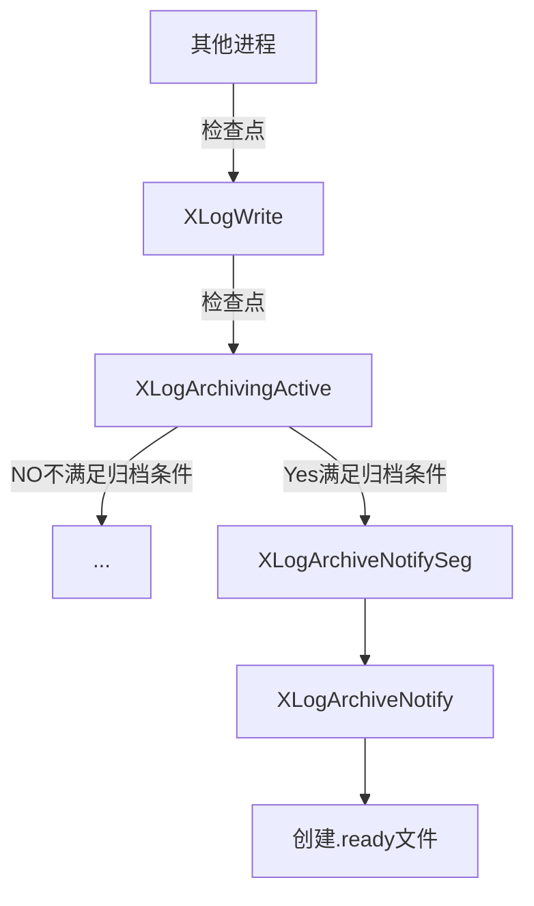

## 现象

> 在shell命令行下，使用ps命令查看PostgreSQL数据库的进程快照信息，可以发现PG有个archiver子进程，其主要负责PG的WAL文件归档工作，对应源文件pgarch.c。

- 查看PostgreSQL数据库的进程快照

```shell
  [coder@localhost build_postgres]$ ps -xf
   PID TTY      STAT   TIME COMMAND
  4972 ?        S      0:00 sshd: coder@pts/1
  4973 pts/1    Ss     0:00  \_ -bash
  18217 pts/1    R+     0:00      \_ ps -xf
  1974 ?        S      0:00 sshd: coder@pts/0
  1975 pts/0    Ss     0:00  \_ -bash
  6425 pts/0    S+     0:00      \_ ./bin/psql -p 5433 -U system -d postgres
  5786 ?        Ss     0:00 /home/coder/workspace/build_postgres/bin/postgres -D data_test
  5787 ?        Ss     0:00  \_ postgres: logger   
  5789 ?        Ss     0:00  \_ postgres: checkpointer   
  5790 ?        Ss     0:03  \_ postgres: background writer   
  5791 ?        Ss     0:06  \_ postgres: walwriter   
  5792 ?        Ss     0:00  \_ postgres: autovacuum launcher   
  5793 ?        Ss     0:00  \_ postgres: archiver   last was 0000000100000000000000B4
  5794 ?        Ss     0:01  \_ postgres: stats collector   
  5795 ?        Ss     0:00  \_ postgres: logical replication launcher   
  6426 ?        Ss     1:00  \_ postgres: system postgres [local] idle
  [coder@localhost build_postgres]$
```

- 查看归档目录archive，发现0000000100000000000000B4文件，为最新的一个归档文件；

```shell
[coder@localhost build_postgres]$ ll archive/ | tail -n 5
-rw-------. 1 coder coder 16777216 2月  20 17:37 0000000100000000000000B0
-rw-------. 1 coder coder 16777216 2月  20 17:37 0000000100000000000000B1
-rw-------. 1 coder coder 16777216 2月  20 17:37 0000000100000000000000B2
-rw-------. 1 coder coder 16777216 2月  20 17:37 0000000100000000000000B3
-rw-------. 1 coder coder 16777216 2月  20 17:37 0000000100000000000000B4
[coder@localhost build_postgres]$
```

- 查看data目录的pg_wal/archive_status目录，发现最新的.done文件是0000000100000000000000B4.done.

```
[coder@localhost build_postgres]$ ll data/pg_wal/archive_status/ | tail -n 5
总用量 0
-rw-------. 1 coder coder 0 2月  20 17:37 0000000100000000000000B0.done
-rw-------. 1 coder coder 0 2月  20 17:37 0000000100000000000000B1.done
-rw-------. 1 coder coder 0 2月  20 17:37 0000000100000000000000B2.done
-rw-------. 1 coder coder 0 2月  20 17:37 0000000100000000000000B3.done
-rw-------. 1 coder coder 0 2月  20 17:37 0000000100000000000000B4.done
[coder@localhost build_postgres]$
```

- 问题
  - .done文件是怎么生成和删除的？
  - .ready文件是什么？

## PG进行wal文件归档的前提

PostgreSQL数据库要执行归档操作，GUC参数需要满足以下要求：

- wal_level配置参数为`replica`或更高；
- archive_mode设置为on;
- archive_command配置参数指定一个shell命令；

## 其他进程创建.ready归档信号文件

其他进程，当发现满足归档条件后，将在pg_wal/archive_status/目录下，创建.ready文件;
创建.ready文件的流程：



## archiver进程执行归档操作

- 当guc参数archive_mode设置为on时，表明启用归档，archiver子进程将被启动；
- 当archiver进程启动后，进入pgarch_MainLoop主循环,循环检测是否存在.ready文件；
- 当检查到.ready文件，归档对应的xlog文件，然后将xxx.ready文件重命名为xxx.done；
- 在执行checkpoint时，会删除.done文件，避免无限增长；

调用流程如下：

