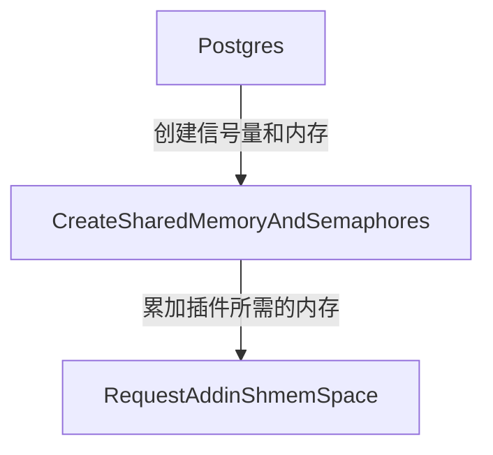
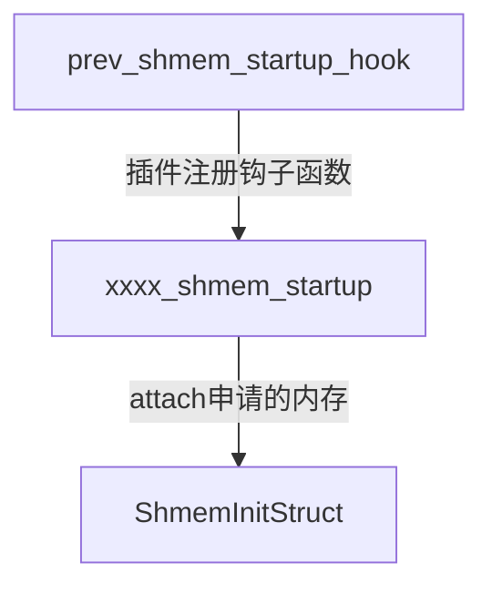
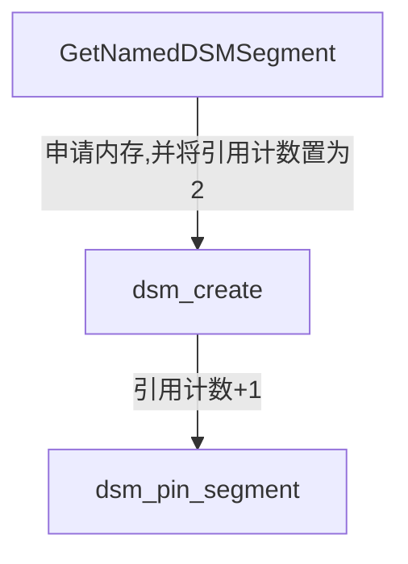

PostgreSQL 12和PostgreSQL 17及其以后得版本，提供了两种不同的方法申请内存，其主要区别在于申请内存的时机不同。
参考链接: https://www.postgresql.org/docs/18/xfunc-c.html#XFUNC-SHARED-ADDIN

## 知识储备

PostgreSQL的内存模型


PostgreSQL的内存模型（包含DSM）


DSM 的设计初衷是支持 “多进程间临时共享数据”，在运行时由某个后台进程按需创建和销毁，主要用于特定进程组之间的临时、高效通信和数据交换，生命周期短暂。（目前并行查询会用到）

## 1. PG申请内存机制

### 数据库启动时申请内存

数据库在启动时，会申请一块大的主内存，各个组件所需的存储大小，提前计算并汇总，一并向系统申请。
插件可以在服务器启动时预留共享内存。要实现此功能，必须通过在shared_preload_libraries中指定插件的共享库来预加载该共享库。共享库还应在其_PG_init函数中注册一个shmem_request_hook。该shmem_request_hook可以通过调用以下函数来预留共享内存：

```C
void RequestAddinShmemSpace(Size size)
{
    if (!process_shmem_requests_in_progress)
        elog(FATAL, "cannot request additional shared memory outside shmem_request_hook");
    total_addin_request = add_size(total_addin_request, size);  /* 累加所需的内存 */
}
```

每个后端应通过调用以下命令获取指向保留共享内存的指针：

```C
void *ShmemInitStruct(const char *name, Size size, bool *foundPtr)
```

第一次调用，foundPtr为false，第二次调用，foundPtr则为true。如果此函数设置foundPtr为false，则调用者应继续初始化保留共享内存的内容。如果foundPtr设置为true，则表示该共享内存已被另一个后端初始化，调用者无需进一步初始化。为了避免竞争条件，每个后端在初始化其共享内存分配时都应使用 LWLock AddinShmemInitLock，如下所示：

```c
static mystruct *ptr = NULL;
bool        found;

LWLockAcquire(AddinShmemInitLock, LW_EXCLUSIVE);
ptr = ShmemInitStruct("my struct name", size, &found);
if (!found)
{
    ... initialize contents of shared memory ...
    ptr->locks = GetNamedLWLockTranche("my tranche name");
}
LWLockRelease(AddinShmemInitLock);
```

PG启动时，累加插件所需的内存，一并向系统申请；



插件注册钩子函数prev_shmem_startup_hook，在数据库启动后，自动通过该钩子函数，将插件attach到申请的内存上，便可操作该内存；



### 数据库在运行时申请内存(pg17及其以后版本)

在PG17及其以后的版本，提供了另一种更灵活的方法来申请共享内存。该方法可以在服务器启动后且在 shmem_request_hook 之外执行。要想做到这一点，每个将要使用共享内存的后端都应通过调用以下函数来获取指向它的指针：

```C
void *GetNamedDSMSegment(const char *name，
                          size_t size，
                          void（*init_callback）（void *ptr），
                          bool *found)
```

如果给定名称的动态共享内存段尚未存在，此函数将分配该内存段，并通过提供的 init_callback 回调函数对其进行初始化。如果该内存段已由另一个后端分配并初始化，此函数会简单地将现有的动态共享内存段附加到当前后端。

与服务器启动时预留的共享内存不同，使用 GetNamedDSMSegment 预留共享内存时，无需获取 AddinShmemInitLock 或采取其他措施来避免竞争条件。此函数确保只有一个后端分配和初始化该内存段，而所有其他后端都会收到指向已完全分配和初始化的内存段的指针。

关于 GetNamedDSMSegment 的完整使用示例，可在 PostgreSQL 源代码树的 src/test/modules/test_dsm_registry/test_dsm_registry.c 中找到。

## 2. 怎么创建PG插件

### 启动时申请内存方式

        介绍在PostgreSQL 12版本中，创建一个最小化的插件，主要涉及编写一个简单的函数、创建控制文件、制作 Makefile，然后进行安装和测试。
主要文件：

> - my_sharedmem_plugin--1.0.sql，定义插件要提供的函数；
> 
> - my_sharedmem_plugin_plugin.c，插件对应的C代码；
> 
> - my_sharedmem_plugin.control，描述插件的基本元信息；
> 
> - Makefile，指导编译和安装过程；

1. 准备SQL脚本：创建一个SQL文件（例如 my_sharedmem_plugin--1.0.sql），定义你的函数。
   这个例子创建一个返回特定信息的函数。

```SQL
-- File: my_sharedmem_plugin--1.0.sql
CREATE OR REPLACE FUNCTION my_greeting()
RETURNS TEXT AS $$
BEGIN
    RETURN 'Hello from my minimal PostgreSQL plugin!';
END;
$$ LANGUAGE plpgsql;

CREATE FUNCTION get_shared_counter()
RETURNS BIGINT
AS 'MODULE_PATHNAME', 'get_shared_counter'
LANGUAGE C STRICT;

CREATE FUNCTION increment_shared_counter(increment BIGINT)
RETURNS BIGINT
AS 'MODULE_PATHNAME', 'increment_shared_counter'
LANGUAGE C STRICT;
```

2. C程序代码文件

```C
#include "postgres.h"
#include "fmgr.h"
#include "storage/ipc.h"
#include "storage/shmem.h"
#include "utils/builtins.h"

PG_MODULE_MAGIC;

/* 定义共享内存结构 */
typedef struct {
    int64 counter;
    bool initialized;
} SharedData;

/* 共享内存指针 */
static SharedData *shared_data = NULL;

/* 共享内存大小 */
#define SHARED_MEM_SIZE sizeof(SharedData)

/* 共享内存初始化钩子 */
void _PG_init(void);
void _PG_fini(void);

/* 函数声明 */
Datum get_shared_counter(PG_FUNCTION_ARGS);
Datum increment_shared_counter(PG_FUNCTION_ARGS);

/* 共享内存请求钩子 */
static void sharedmem_request_hook(void);
static shmem_request_hook_type prev_shmem_request_hook = NULL;

void
_PG_init(void)
{
    /* 注册共享内存请求钩子 */
    prev_shmem_request_hook = shmem_request_hook;
    shmem_request_hook = sharedmem_request_hook;

    /* 注册函数 */
    RegisterXactCallback(sharedmem_xact_callback, NULL);
}

void
_PG_fini(void)
{
    /* 恢复之前的钩子 */
    shmem_request_hook = prev_shmem_request_hook;
}

static void
sharedmem_request_hook(void)
{
    if (prev_shmem_request_hook)
        prev_shmem_request_hook();

    /* 请求共享内存 */
    RequestAddinShmemSpace(SHARED_MEM_SIZE);
}

/* 共享内存启动钩子 */
void
sharedmem_startup_hook(void)
{
    bool found;

    /* 在共享内存中分配空间 */
    shared_data = (SharedData *) ShmemInitStruct("my_sharedmem_plugin", 
                                                SHARED_MEM_SIZE, 
                                                &found);
    if (!found)
    {
        /* 第一次初始化 */
        memset(shared_data, 0, SHARED_MEM_SIZE);
        shared_data->initialized = true;
        elog(LOG, "My shared memory plugin initialized");
    }
}

/* 获取共享计数器值 */
PG_FUNCTION_INFO_V1(get_shared_counter);
Datum
get_shared_counter(PG_FUNCTION_ARGS)
{
    if (!shared_data || !shared_data->initialized)
        ereport(ERROR,
                (errcode(ERRCODE_OBJECT_NOT_IN_PREREQUISITE_STATE),
                 errmsg("shared memory not initialized")));

    PG_RETURN_INT64(shared_data->counter);

}

/* 增加共享计数器值 */
PG_FUNCTION_INFO_V1(increment_shared_counter);
Datum
increment_shared_counter(PG_FUNCTION_ARGS)
{
    int64 increment = PG_GETARG_INT64(0);

    if (!shared_data || !shared_data->initialized)
        ereport(ERROR,
                (errcode(ERRCODE_OBJECT_NOT_IN_PREREQUISITE_STATE),
                 errmsg("shared memory not initialized")));

    /* 需要适当的锁机制来保证线程安全 */
    shared_data->counter += increment;

    PG_RETURN_INT64(shared_data->counter);

}
```

3. 创建控制文件：创建一个控制文件（例如 my_sharedmem_plugin.control），提供插件的元数据。

```ini
# File: my_sharedmem_plugin.control
comment = 'A minimal example PostgreSQL extension'
default_version = '1.0'
module_pathname = '$libdir/my_sharedmem_plugin'
relocatable = true
```

配置解读:

```ini
- comment: 插件的简短描述。
- default_version: 插件的默认版本。
- module_pathname: 如果需要C语言函数，可以指定共享库路径（本例中PL/pgSQL函数非必须）。
- relocatable: 表示插件中的对象是否可以移动到不同的模式中。
```

3. 编写Makefile：创建一个 Makefile 来指导构建和安装过程。PGXS (PostgreSQL Extension Build Infrastructure) 会简化此过程。

```makefile
# File: Makefile
EXTENSION = my_sharedmem_plugin        # 插件的名称，必须和控制文件基础名相同
DATA = my_sharedmem_plugin--1.0.sql    # 要安装的SQL脚本文件
MODULES = my_sharedmem_plugin.o        # 如果需要编译C代码，在此列出目标文件。
PG_CONFIG = pg_config
PGXS := $(shell $(PG_CONFIG) --pgxs)
include $(PGXS)
```

4. 安装插件：使用 make install 命令将插件文件复制到 PostgreSQL 的共享目录（如 /usr/pgsql-12/share/extension/）。确保你的用户有足够的权限

```bash
make install
```

5. 在数据库中测试插件：连接到目标数据库并运行 CREATE EXTENSION 命令。

```SQL
-- 连接到数据库
psql my_database

-- 在数据库中创建插件
my_database=# CREATE EXTENSION my_sharedmem_plugin;
CREATE EXTENSION

-- 测试插件提供的函数
my_database=# SELECT my_greeting();
                my_greeting
-------------------------------------------
 Hello from my minimal PostgreSQL plugin!
(1 row)

-- 验证插件已安装
my_database=# \dx
```

### 运行时申请内存方式

与启动时申请内存的差异在于C代码中申请内存的方式不同。其是通过调用GetNamedDSMSegment函数，实现内存的动态申请。

```C
/*--------------------------------------------------------------------------
 *
 * test_dsm_registry.c
 *      Test the dynamic shared memory registry.
 *
 * Copyright (c) 2024-2025, PostgreSQL Global Development Group
 *
 * IDENTIFICATION
 *        src/test/modules/test_dsm_registry/test_dsm_registry.c
 *
 * -------------------------------------------------------------------------
 */
#include "postgres.h"

#include "fmgr.h"
#include "storage/dsm_registry.h"
#include "storage/lwlock.h"

PG_MODULE_MAGIC;

typedef struct TestDSMRegistryStruct
{
    int            val;
    LWLock        lck;
} TestDSMRegistryStruct;

static TestDSMRegistryStruct *tdr_state;

static void
tdr_init_shmem(void *ptr)
{
    TestDSMRegistryStruct *state = (TestDSMRegistryStruct *) ptr;

    LWLockInitialize(&state->lck, LWLockNewTrancheId());
    state->val = 0;
}

static void
tdr_attach_shmem(void)
{
    bool        found;

    tdr_state = GetNamedDSMSegment("test_dsm_registry",
                                   sizeof(TestDSMRegistryStruct),
                                   tdr_init_shmem,
                                   &found);
    LWLockRegisterTranche(tdr_state->lck.tranche, "test_dsm_registry");
}

PG_FUNCTION_INFO_V1(set_val_in_shmem);
Datum
set_val_in_shmem(PG_FUNCTION_ARGS)
{
    tdr_attach_shmem();

    LWLockAcquire(&tdr_state->lck, LW_EXCLUSIVE);
    tdr_state->val = PG_GETARG_INT32(0);
    LWLockRelease(&tdr_state->lck);

    PG_RETURN_VOID();
}

PG_FUNCTION_INFO_V1(get_val_in_shmem);
Datum
get_val_in_shmem(PG_FUNCTION_ARGS)
{
    int            ret;

    tdr_attach_shmem();

    LWLockAcquire(&tdr_state->lck, LW_SHARED);
    ret = tdr_state->val;
    LWLockRelease(&tdr_state->lck);

    PG_RETURN_INT32(ret);
}
```

#### 源码解读

dsm内存段的状态数据结构：dsm_control_item

```c
--- dsm.c
typedef struct dsm_control_item
{
    dsm_handle    handle;
    uint32        refcnt;            /* 2+ = active, 1 = moribund, 0 = gone */
    size_t        first_page;
    size_t        npages;
    void       *impl_private_pm_handle; /* only needed on Windows */
    bool        pinned;
} dsm_control_item;
```

        refcnt为内存段的引用计数，只要有后台进程attach了该内存段，引用计数将加1，当进程销毁，则引用计数减1。默认创建内存段时，初始值为2。
**refcnt = 2** ，表示内存段处于活跃状态，有进程使用；
**refcnt = 1** ，表示内存段处于待释放状态，即将被释放；
**refcnt = 0** ，表示该内存段已释放；

        PG提供了dsm_pin_segment、dsm_unpin_segment函数，来锁住和解锁一个内存段。

        在GetNamedDSMSegment函数中，通过dsm_creat将内存段的引用计数置为2,表示内存在使用中，再通过dsm_pin_segment，将refcnt+1，而dsm_registry.c函数中，并未提供upin的接口。
        
        如果某个附加了该内存段，在会话断开时，将调用dsm_backend_shutdown函数，在dsm_detach子函数中，将refcnt-1后，引用计数为2，不满足清理内存段的要求，所以该内存段将一直保持，与Postmaster生命周期一致。



```c
--- dsm_registry.c
void *GetNamedDSMSegment(const char *name, size_t size,
                   void (*init_callback) (void *ptr), bool *found)
{
    DSMRegistryEntry *entry;
    MemoryContext oldcontext;
    void       *ret;

    /*省略*/

    oldcontext = MemoryContextSwitchTo(TopMemoryContext);

    /* Connect to the registry. */
    init_dsm_registry();

    entry = dshash_find_or_insert(dsm_registry_table, name, found);
    if (!(*found))
    {
        /* Initialize the segment. */
        dsm_segment *seg = dsm_create(size, 0);

        dsm_pin_segment(seg); 
        /* pin住内存段，避免被释放 */

        dsm_pin_mapping(seg);
        entry->handle = dsm_segment_handle(seg);
        entry->size = size;
        ret = dsm_segment_address(seg);

        if (init_callback)
            (*init_callback) (ret);
    }
    else if (entry->size != size)
    {
        ereport(ERROR,
                (errmsg("requested DSM segment size does not match size of "
                        "existing segment")));
        /* 插件升级，如果新版本内存大小与旧版本申请的内存大小不一致，则会在这里报错 */           
    }
    else
    {
        dsm_segment *seg = dsm_find_mapping(entry->handle);

        /* If the existing segment is not already attached, attach it now. */
        if (seg == NULL)
        {
            seg = dsm_attach(entry->handle);
            if (seg == NULL)
                elog(ERROR, "could not map dynamic shared memory segment");

            dsm_pin_mapping(seg);
        }
        ret = dsm_segment_address(seg);
    }

    dshash_release_lock(dsm_registry_table, entry);
    MemoryContextSwitchTo(oldcontext);

    return ret;
}
```

## 4. 一些思考

### 特征对比

| 对比维度                   | 启动时预分配内存 (ShmemInitStruct)            | 运行时动态 DSM 内存 (GetNamedDSMSegment /dsm_registry)                                |
| ---------------------- | ------------------------------------- | ------------------------------------------------------------------------------ |
| 内存类型                   | 主共享内存 (Main Shared Memory)            | 动态共享内存 (Dynamic Shared Memory Segments - DSM)                                  |
| <mark>**分配时机**</mark>  | PostgreSQL 服务器启动初始化阶段                 | 数据库运行过程中，按需动态分配                                                                |
| **<mark>生命周期</mark>**  | 与 PostgreSQL 服务器进程同生命周期：从启动分配到关闭释放    | dsm_registry未提供释放接口，与服务器生命周期相同。                                                |
| 管理方式                   | 通过 ShmemIndex（共享哈希表）管理和查找             | 通过 dsm_registry（主共享内存中的键值注册表）跟踪和管理                                             |
| **<mark>大小灵活性</mark>** | 固定大小：启动时一次性计算分配，后续无法更改                | 动态灵活：可根据运行时需要申请不同大小的段                                                          |
| 互斥机制                   | 通过轻量级锁（LWLock）、自旋锁（Spinlock）等保护       | 同样依赖轻量级锁（LWLock）等 PostgreSQL 标准同步机制（如 dsm_registry 中使用`DSMRegistryLock`进行并发控制） |
| 主要使用场景                 | 存储核心全局数据结构，如锁表、缓冲池、事务状态等              | 并行查询、批量数据处理等临时性任务。（**<mark>可用于不停机升级插件</mark>**）                                |
| 性能影响                   | 启动时分配，运行时无分配开销。但分配过多浪费内存，过少限制运行       | 运行时分配有一定开销，但避免启动时预留过多内存，更节省资源                                                  |
| 操作系统依赖                 | 通常使用 System V 共享内存或 mmap 匿名映射         | 支持多种后端（mmap、System V SHM、Windows 原生等）                                          |
| **<mark>指针访问**</mark>  | 使用普通指针（子进程通过fork继承内存地址，所有进程映射到相同虚拟地址） | 可能是子进程动态申请的，后端连接非父子进程，无法通过fork继承内存地址。需借助基于段的相对偏移（DSA）访问                        |

### DSM申请的内存大小是否受限？

PostgreSQL 从跨平台兼容性考虑，兼容了不同平台的共享内存方式。dsm默认使用POSIX方式，其依赖于/dev/shm的大小。如果/dev/shm过小，可能会导致dsm申请内存失败，而引入DSM后，这种情况可能会加剧。

解决方法：PG可以通过GUC参数`dynamic_shared_memory_type`，配置申请内存的方式。

| 实现方式                                | 底层机制                                                                                                                                                                                                                                         | 主要系统级限制                                                                                                     | 特点与注意事项                                                                                    |
| ----------------------------------- | -------------------------------------------------------------------------------------------------------------------------------------------------------------------------------------------------------------------------------------------- | ----------------------------------------------------------------------------------------------------------- | ------------------------------------------------------------------------------------------ |
| **POSIX 共享内存** (`DSM_IMPL_POSIX`)   | 使用 [`shm_open()`](https://man7.org/linux/man-pages/man3/shm_open.3.html) 创建对象，并通过 [`mmap()`](https://man7.org/linux/man-pages/man2/mmap.2.html) 映射到进程内存。                                                                                     | **受 `/dev/shm` 挂载点大小限制**（通常为系统物理内存的一半）。可通过 `mount -o remount,size=XXG /dev/shm` 临时调整，或在 `/etc/fstab` 中永久修改。 | **Linux 默认方式**。速度较快，因为基于内存文件系统。                                                            |
| **System V 共享内存** (`DSM_IMPL_SYSV`) | 使用 [`shmget()`](https://man7.org/linux/man-pages/man2/shmget.2.html) 和 [`shmat()`](https://man7.org/linux/man-pages/man2/shmat.2.html) 等系统调用。                                                                                                | 受 **`shmmax`**（单个段最大大小）、**`shmall`**（系统总共享内存页数）、**`shmmni`**（最大段数量）等内核参数限制。                                 | 历史悠久，跨 UNIX 兼容性好。但默认限制通常较低，需要手动调整内核参数 (`/etc/sysctl.conf`) 。管理上不如 POSIX 灵活。                |
| **mmap 实现** (`DSM_IMPL_MMAP`)       | 直接在临时文件（如 `$PGDATA/pgsql_tmp` 下）上调用 [`mmap()`](https://man7.org/linux/man-pages/man2/mmap.2.html)。                                                                                                                                           | **受底层文件系统可用空间限制**（因为会创建临时文件）。<br>可能受**文件系统大小**、**inode 数量**等限制。                                             | **一种可靠的备选方案**。当 POSIX 和 SYSV 不可用或资源耗尽时会 fallback 到此方式。**性能可能稍差**，因为涉及磁盘 I/O（除非文件在内存文件系统上）。 |
| **Windows 实现** (`DSM_IMPL_WINDOWS`) | 使用 [`CreateFileMapping()`](https://docs.microsoft.com/en-us/windows/win32/api/memoryapi/nf-memoryapi-createfilemappingw) 和 [`MapViewOfFile()`](https://docs.microsoft.com/en-us/windows/win32/api/memoryapi/nf-memoryapi-mapviewoffile) API。 | 主要受**系统可用物理内存**和**页面文件（虚拟内存）** 的大小配置限制。                                                                     | **Windows 系统的原生实现**。行为与其它方式类似，但受 Windows 自身的内存管理策略约束。                                      |

### DSM registry机制，可以用在哪里？

- 灵活创建插件
  - 优化单机在线扩展为集群功能，无需要求提前设置shared_preload_libraries参数；
- 插件不停机升级
  - 插件申请内存大小不变的情况下，可以直接升级；
  - 插件申请内存大小发生变化的情况下，可以调整插件内存段命名，重新申请一块内存来实现；


## 5. 扩展

在后期版本(PG19)，可能会引入一下DSM相关的新提交，用于增加dsm的可观测性和灵活性。
https://tselai.com/pg-dsm-registry-allocations

### 增加pg_dsm_registry_allocations系统视图，提高可观测性

**代码地址**

https://github.com/postgres/postgres/commit/167ed80

**主要改动**

增加系统视图，用于跟踪动态共享内存内存（DSM）的分配情况；

**目的**

增加可观测性；

**提交描述**
此提交添加了一个新的系统视图，该视图提供有关动态共享内存（DSM）注册表中条目的信息。具体来说，它返回每个条目的名称、类型和大小。

视图查询效果如下：

```SQL
SELECT name, type, size IS DISTINCT FROM 0 AS size
FROM pg_dsm_registry_allocations
WHERE name LIKE 'test_dsm_registry%'
ORDER BY name;

          name          |  type   | size 
------------------------+---------+------
 test_dsm_registry_dsa  | area    | xxxx
 test_dsm_registry_dsm  | segment | xxxx
 test_dsm_registry_hash | hash    | xxxx
(3 rows)
```

### 增加了更多函数接口，提供使用灵活性

**代码地址** 
https://github.com/postgres/postgres/commit/fe07100

**主要改动** 

增加了GetNamedDSA() 和 GetNamedDSHash() 函数接口，这些变体函数简化了在 DSM 注册表内部分配动态共享区域（DSA）和动态共享哈希表（dshash）的过程。

**目的**

添加接口，增加灵活性，应对更复杂的场景；

**提交描述**
目前，动态共享内存（DSM）注册表仅提供 GetNamedDSMSegment () 函数，该函数用于分配固定大小的段。若要将 DSM 注册表用于更复杂的场景，例如动态共享内存区域（DSA）或由 DSA 支持的哈希表（dshash），用户需要创建一个存储各种句柄和轻量级锁（LWLock）传输 ID 的 DSM 段，并且要编写相当复杂的初始化代码。此外，不同库之间的这种初始化代码可能几乎没有差异。
本次提交引入了一些函数，用于简化在 DSM 注册表中分配 DSA 或 dshash 的操作。这些函数与 GetNamedDSMSegment () 非常相似。显著的区别包括：缺少初始化回调参数，以及禁止在每个后端中对给定条目多次调用这些函数（这在大多数情况下应该很容易避免）。与此同时，本次提交将 DSM 注册表条目的最大名称长度从 63 字节增加到了 127 字节。

        还需注意的是，尽管理论上可以分离 / 销毁在注册表中创建的 DSA 和 dshash，但这类使用场景目前尚未得到良好支持，原因之一是相关的 DSM 注册表条目无法删除。添加此类支持将留待未来解决。
test_dsm_registry 测试模块包含对这些新函数的测试，同时也作为一个完整的使用示例。

### 参考资料

关于dsm registry，开源社区讨论邮件地址：

> https://www.postgresql.org/message-id/20231205034647.GA2705267%40nathanxps13

dsm registry相关的代码提交：

```ini
commit 8b2bcf3f287c79eaebf724cba57e5ff664b01e06
Author: Nathan Bossart <nathan@postgresql.org>
Date:   Fri Jan 19 14:24:36 2024 -0600
```